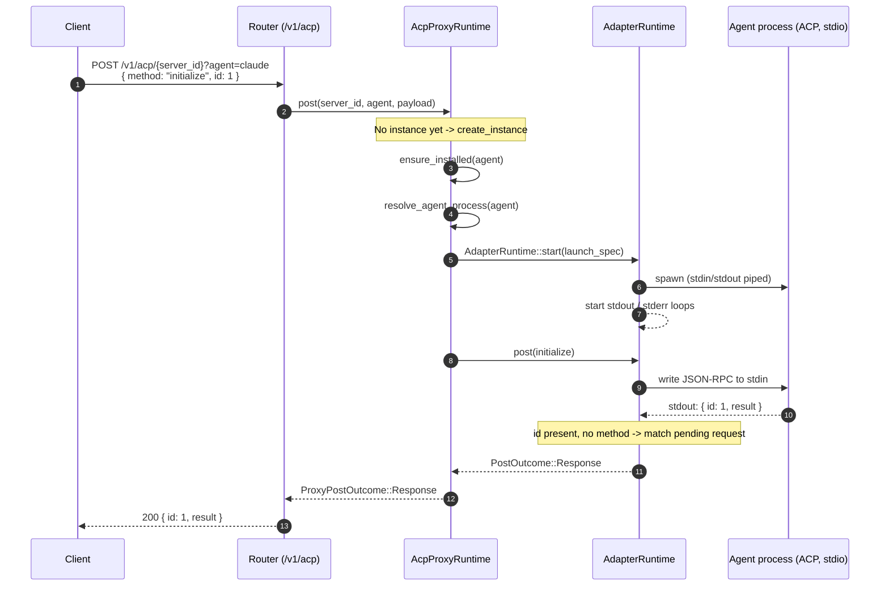
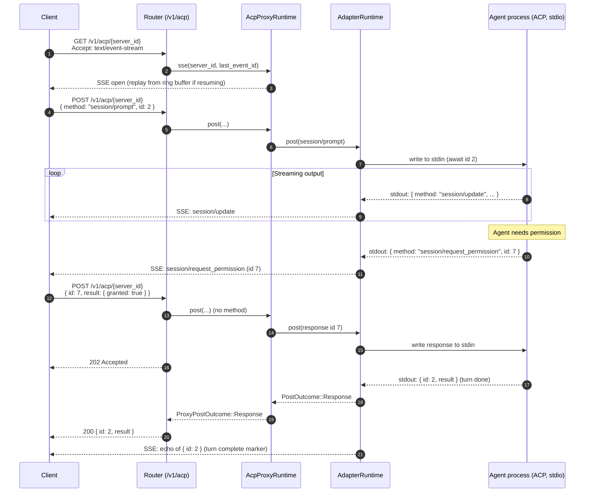

The `/v1/acp` surface exposes the Agent Client Protocol (ACP) over HTTP. It lets
an ACP-aware client drive a coding agent that runs as a subprocess inside the
sandbox, using plain JSON-RPC envelopes carried over HTTP and Server-Sent Events
(SSE). This page documents the transport and the session lifecycle.

This page describes ACP protocol details intentionally. Other docs describe the
SDK surface in user-facing terms instead.

## Endpoints

| Method | Path | Purpose |
|--------|------|---------|
| `GET` | `/v1/acp` | List active ACP server instances |
| `POST` | `/v1/acp/{server_id}` | Send a JSON-RPC request, notification, or response to the agent |
| `GET` | `/v1/acp/{server_id}` | Open the SSE downstream (notifications and server-initiated requests) |
| `DELETE` | `/v1/acp/{server_id}` | Close the instance and stop the agent process |

`server_id` is client-defined. The first `POST` for a new `server_id` must
include the `agent` query parameter (for example `?agent=claude`) so the proxy
knows which agent process to launch. Subsequent calls reuse the same instance,
and a mismatched `agent` returns `409`.

### Request and response rules

- `POST` with both `method` and `id` is a JSON-RPC **request**: the proxy writes
  it to the agent's stdin, awaits the matching response, and returns `200` with
  the response envelope.
- `POST` without `method` (a notification, or a client response to a
  server-initiated request) is written to stdin and returns `202 Accepted`.
- `Content-Type` must be `application/json` (`415` otherwise) and `Accept` must
  allow `application/json` on `POST` (`406` otherwise). The `GET` stream requires
  `Accept: text/event-stream`.
- A request that the agent does not answer within the configured timeout returns
  `504`.

## Session bootstrap

The first `POST` lazily creates the instance: the proxy ensures the agent is
installed, resolves its launch spec, and spawns the ACP subprocess with piped
stdin/stdout before forwarding the envelope.

After `initialize`, the client typically sends `session/new` (also a `POST`),
receives a session id in the `200` response, then opens the SSE stream to receive
streaming updates for that session.

## Prompt turn with streaming and permissions

The agent's stdout is multiplexed by the adapter. Lines that carry an `id` and no
`method` are responses and are matched to the awaiting `POST`. Everything else
(notifications such as `session/update`, and server-initiated requests such as a
permission prompt) is broadcast to the SSE stream. The proxy also echoes the
final response onto the stream so SSE subscribers can detect turn completion in
order.

## Stream resumption

The SSE downstream is backed by a per-instance ring buffer. Reconnecting clients
send the standard `Last-Event-ID` header; the proxy replays buffered envelopes
after that sequence number before resuming live delivery. The stream emits a
`heartbeat` keep-alive every 15 seconds.

## Closing a session

`DELETE /v1/acp/{server_id}` removes the instance and shuts down the agent
process. Pending SSE streams for that instance end. A later `POST` with the same
`server_id` starts a fresh instance.

## Implementation map

| Concern | Source |
|---------|--------|
| HTTP handlers | `server/packages/sandbox-agent/src/router.rs` (`post_v1_acp`, `get_v1_acp`, `delete_v1_acp`, `get_v1_acp_servers`) |
| Instance lifecycle, payload normalization | `server/packages/sandbox-agent/src/acp_proxy_runtime.rs` |
| Subprocess transport, request/response matching, SSE ring buffer | `server/packages/acp-http-adapter/src/process.rs` |
| Agent launch specs (binary, ACP command, install) | `server/packages/agent-management/src/agents.rs` |
