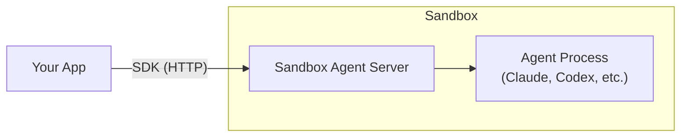

Sandbox Agent is a lightweight HTTP server that runs **inside** a sandbox. It:

- **Agent management**: Installs, spawns, and stops coding agent processes
- **Sessions**: Routes prompts to agents and streams events back in real time
- **Sandbox APIs**: Filesystem, process, and terminal access for the sandbox environment

## Components



- **Your app**: Uses the `sandbox-agent` TypeScript SDK to talk to the server over HTTP.
- **Sandbox**: An isolated runtime (local process, Docker, E2B, Daytona, Vercel, Cloudflare).
- **Sandbox Agent server**: A single binary inside the sandbox that manages agent lifecycles, routes prompts, streams events, and exposes filesystem/process/terminal APIs.
- **Agent process**: A coding agent (Claude Code, Codex, etc.) spawned by the server. Each session maps to one agent process.

## What `SandboxAgent.start()` does

1. **Provision**: The provider creates a sandbox (starts a container, creates a VM, etc.)
2. **Install**: The Sandbox Agent binary is installed inside the sandbox
3. **Boot**: The server starts listening on an HTTP port
4. **Health check**: The SDK waits for `/v1/health` to respond
5. **Ready**: The SDK returns a connected client

For the `local` provider, provisioning is a no-op and the server runs as a local subprocess.

### Server recovery

If the server process stops, the SDK automatically calls the provider's `ensureServer()` after 3 consecutive health-check failures. Most built-in providers implement this. Custom providers can add `ensureServer(sandboxId)` to their `SandboxProvider` object.

## Server HTTP API

See the [HTTP API reference](/docs/api-reference) for the full list of server endpoints.

## Agent installation

Agents are installed lazily on first use. To avoid the cold-start delay, pre-install them:

```bash
sandbox-agent install-agent --all
```

The `rivetdev/sandbox-agent:0.4.2-full` Docker image ships with all agents pre-installed.

## Production-ready agent orchestration

For production deployments, see [Orchestration Architecture](/docs/orchestration-architecture) for recommended topology, backend requirements, and session persistence patterns.
