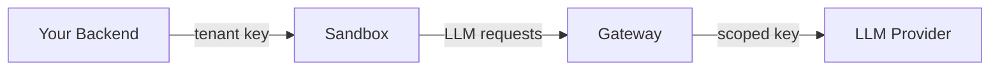

Sandbox Agent needs LLM provider credentials (Anthropic, OpenAI, etc.) to run agent sessions.

## Configuration

Pass credentials via `spawn.env` when starting a sandbox. Each call to `SandboxAgent.start()` can use different credentials:

```typescript
import { SandboxAgent } from "sandbox-agent";

const sdk = await SandboxAgent.start({
  spawn: {
    env: {
      ANTHROPIC_API_KEY: "sk-ant-...",
      OPENAI_API_KEY: "sk-...",
    },
  },
});
```

Each agent requires credentials from a specific provider. Sandbox Agent checks environment variables (including those passed via `spawn.env`) and host config files:

| Agent | Provider | Environment variables | Config files |
|-------|----------|----------------------|--------------|
| Claude Code | Anthropic | `ANTHROPIC_API_KEY`, `CLAUDE_API_KEY` | `~/.claude.json`, `~/.claude/.credentials.json` |
| Amp | Anthropic | `ANTHROPIC_API_KEY`, `CLAUDE_API_KEY` | `~/.amp/config.json` |
| Codex | OpenAI | `OPENAI_API_KEY`, `CODEX_API_KEY` | `~/.codex/auth.json` |
| OpenCode | Anthropic or OpenAI | `ANTHROPIC_API_KEY`, `OPENAI_API_KEY` | `~/.local/share/opencode/auth.json` |
| Mock | None | - | - |

## Credential strategies

LLM credentials are passed into the sandbox as environment variables. The agent and everything inside the sandbox has access to the token, so it's important to choose the right strategy for how you provision and scope these credentials.

| Strategy | Who pays | Cost attribution | Best for |
|----------|----------|-----------------|----------|
| **Per-tenant gateway** (recommended) | Your organization, billed back per tenant | Per-tenant keys with budgets | Multi-tenant SaaS, usage-based billing |
| **Bring your own key** | Each user (usage-based) | Per-user by default | Dev environments, internal tools |
| **Shared API key** | Your organization | None (single bill) | Single-tenant apps, internal platforms |
| **Personal subscription** | Each user (existing subscription) | Per-user by default | Local dev, internal tools where users have Claude or Codex subscriptions |

### Per-tenant gateway (recommended)

Route LLM traffic through a gateway that mints per-tenant API keys, each with its own spend tracking and budget limits.



Your backend issues a scoped key per tenant, then passes it to the sandbox. This is the typical pattern when using sandbox providers (E2B, Daytona, Docker).

```typescript
import { SandboxAgent } from "sandbox-agent";

async function createTenantSandbox(tenantId: string) {
  // Issue a scoped key for this tenant via OpenRouter
  const res = await fetch("https://openrouter.ai/api/v1/keys", {
    method: "POST",
    headers: {
      Authorization: `Bearer ${process.env.OPENROUTER_PROVISIONING_KEY}`,
      "Content-Type": "application/json",
    },
    body: JSON.stringify({
      name: `tenant-${tenantId}`,
      limit: 50,
      limitResetType: "monthly",
    }),
  });
  const { key } = await res.json();

  // Start a sandbox with the tenant's scoped key
  const sdk = await SandboxAgent.start({
    spawn: {
      env: {
        OPENAI_API_KEY: key, // OpenRouter uses OpenAI-compatible endpoints
      },
    },
  });

  const session = await sdk.createSession({
    agent: "claude",
    sessionInit: { cwd: "/workspace" },
  });

  return { sdk, session };
}
```

#### Security

Recommended for multi-tenant applications. Each tenant gets a scoped key with its own budget, so exfiltration only exposes that tenant's allowance.

#### Use cases

- **Multi-tenant SaaS**: per-tenant spend tracking and budget limits
- **Production apps**: exposed to end users who need isolated credentials
- **Usage-based billing**: each tenant pays for their own consumption

#### Choosing a gateway

<details>
<summary>OpenRouter provisioned keys</summary>

Managed service, zero infrastructure. [OpenRouter](https://openrouter.ai/docs/features/provisioning-api-keys) provides per-tenant API keys with spend tracking and budget limits via their Provisioning API. Pass the tenant key to Sandbox Agent as `OPENAI_API_KEY` (OpenRouter uses OpenAI-compatible endpoints).

```bash
# Create a key for a tenant with a $50/month budget
curl https://openrouter.ai/api/v1/keys \
  -H "Authorization: Bearer $PROVISIONING_KEY" \
  -H "Content-Type: application/json" \
  -d '{
    "name": "tenant-acme",
    "limit": 50,
    "limitResetType": "monthly"
  }'
```

Easiest to set up but not open-source. See [OpenRouter pricing](https://openrouter.ai/docs/framework/pricing) for details.

</details>

<details>
<summary>LiteLLM proxy</summary>

Self-hosted, open-source (MIT). [LiteLLM](https://github.com/BerriAI/litellm) is an OpenAI-compatible proxy with hierarchical budgets (org, team, user, key), virtual keys, and spend tracking. Requires Python + PostgreSQL.

```bash
# Create a team (tenant) with a $500 budget
curl http://litellm:4000/team/new \
  -H "Authorization: Bearer $LITELLM_MASTER_KEY" \
  -H "Content-Type: application/json" \
  -d '{
    "team_alias": "tenant-acme",
    "max_budget": 500
  }'

# Generate a key for that team
curl http://litellm:4000/key/generate \
  -H "Authorization: Bearer $LITELLM_MASTER_KEY" \
  -H "Content-Type: application/json" \
  -d '{
    "team_id": "team-abc123",
    "max_budget": 100
  }'
```

Full control with no vendor lock-in. Organization-level features require an enterprise license.

</details>

<details>
<summary>Portkey gateway</summary>

Self-hosted, open-source (Apache 2.0). [Portkey](https://github.com/Portkey-AI/gateway) is a lightweight OpenAI-compatible gateway supporting 200+ providers. Single binary, no database required. Create virtual keys with per-tenant budget limits and pass them to Sandbox Agent.

Lightest operational footprint of the self-hosted options. Observability and analytics require the managed platform or your own tooling.

</details>

To bill tenants for LLM usage, use [Stripe token billing](https://docs.stripe.com/billing/token-billing) (integrates natively with OpenRouter) or query your gateway's spend API and feed usage into your billing system.

### Bring your own key

Each user provides their own API key. Users are billed directly by the LLM provider with no additional infrastructure needed.

Pass the user's key via `spawn.env`:

```typescript
const sdk = await SandboxAgent.start({
  spawn: {
    env: {
      ANTHROPIC_API_KEY: userProvidedKey,
    },
  },
});
```

#### Security

API keys are typically long-lived. The key is visible to the agent and anything running inside the sandbox, so exfiltration is possible. This is usually acceptable for developer-facing tools where the user owns the key.

#### Use cases

- **Developer tools**: each user manages their own API key
- **Internal platforms**: users already have LLM provider accounts
- **Per-user billing**: no extra infrastructure needed

### Shared credentials

A single organization-wide API key is used for all sessions. All token usage appears on one bill with no per-user or per-tenant cost attribution.

```typescript
const sdk = await SandboxAgent.start({
  spawn: {
    env: {
      ANTHROPIC_API_KEY: process.env.ORG_ANTHROPIC_KEY!,
      OPENAI_API_KEY: process.env.ORG_OPENAI_KEY!,
    },
  },
});
```

If you need to track or limit spend per tenant, use a per-tenant gateway instead.

#### Security

Not recommended for anything other than internal tooling. A single exfiltrated key exposes your organization's entire LLM budget. If you need org-paid credentials for external users, use a per-tenant gateway with scoped keys instead.

#### Use cases

- **Single-tenant apps**: small number of users, one bill
- **Prototyping**: cost attribution not needed yet
- **Simplicity over security**: acceptable when exfiltration risk is low

### Personal subscription

If the user is signed into Claude Code or Codex on the host machine, Sandbox Agent automatically picks up their OAuth tokens. No configuration is needed.

#### Remote sandboxes

Extract credentials locally and pass them to a remote sandbox via `spawn.env`:

```bash
$ sandbox-agent credentials extract-env
ANTHROPIC_API_KEY=sk-ant-...
CLAUDE_API_KEY=sk-ant-...
OPENAI_API_KEY=sk-...
CODEX_API_KEY=sk-...
```

Use `-e` to prefix with `export` for shell sourcing.

#### Security

Personal subscriptions use OAuth tokens with a limited lifespan. These are the same credentials used when running an agent normally on the host. If a token is exfiltrated from the sandbox, the exposure window is short.

#### Use cases

- **Local development**: users are already signed into Claude Code or Codex
- **Internal tools**: every user has their own subscription
- **Prototyping**: no key management needed
