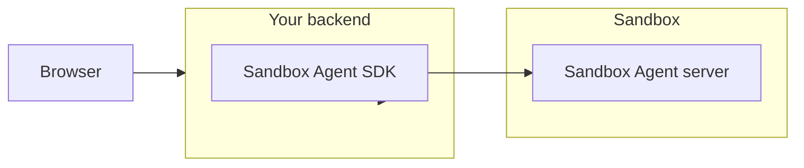

This page covers production topology and backend requirements. Read [Architecture](/docs/architecture) first for an overview of how the server, SDK, and agent processes fit together.

## Suggested Topology

Run the SDK on your backend, then call it from your frontend.

This extra hop is recommended because it keeps auth/token logic on the backend and makes persistence simpler.

### Backend requirements

Your backend layer needs to handle:

- **Long-running connections**: prompts can take minutes.
- **Session affinity**: follow-up messages must reach the same session.
- **State between requests**: session metadata and event history must persist across requests.
- **Graceful recovery**: sessions should resume after backend restarts.

We recommend [Rivet](https://rivet.dev) over serverless because actors natively support the long-lived connections, session routing, and state persistence that agent workloads require.

## Session persistence

For storage driver options and replay behavior, see [Persisting Sessions](/docs/session-persistence).
